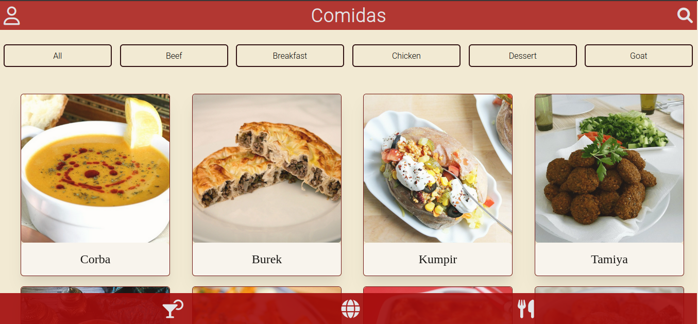
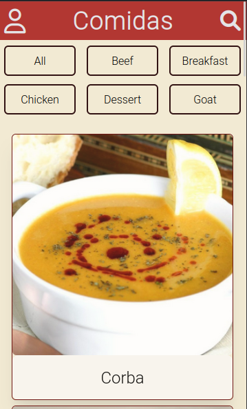

# Projeto Recipes App | Trybe

## 📷 Screenshot



## 📋 Descrição do projeto
Foi desenvolvido um aplicativo de receitas através de duas APIs diferentes. Com ele você consegue buscar receitas por nome, ingrediente, local de origem, favorita-las e executa-las, e consegue visualizar as favoritas e feitas depois.
Buscamos atender a um design responsivo tanto para mobile quanto para web. 

## 💻 Tecnologias utilizadas
- React
- ReduxToolkit
- JavaScript
- CSS/Tailwind

## Links
 - [Projeto estilizado](https://github.com/muriloommaia/app-receita)

## Instalação / Uso 
```
git clone git@github.com:Exodin1/project-recipes-app.git || git@github.com:muriloommaia/app-receita.git
cd project-recipes-app
npm install
npm start
```

## 📈 Status do projeto
✅ Concluído
